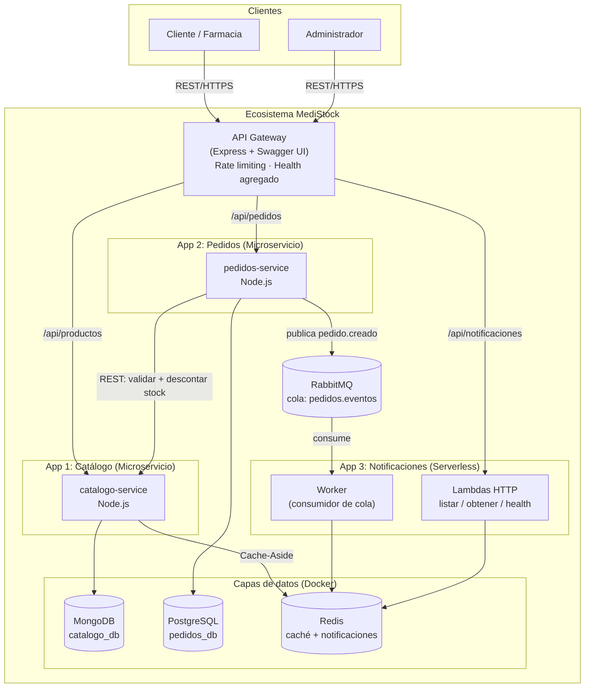
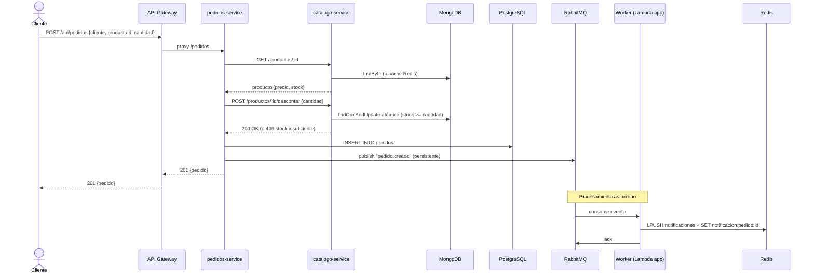
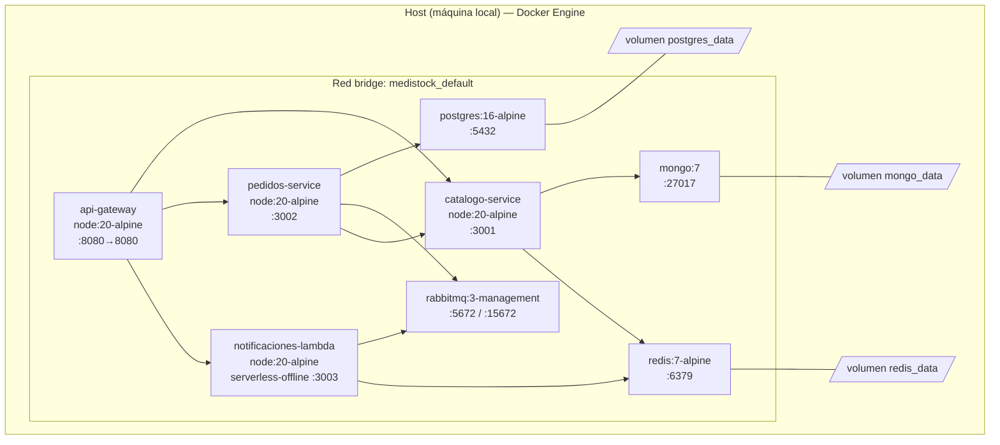
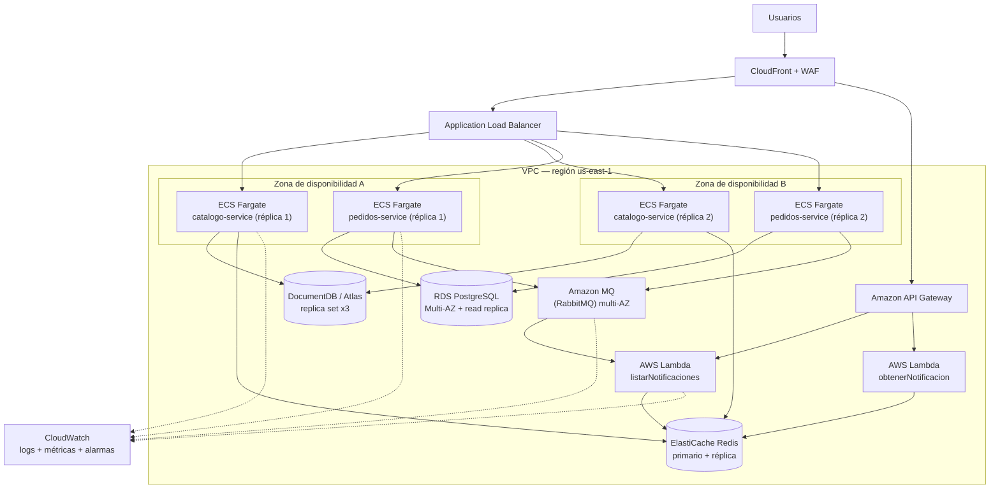
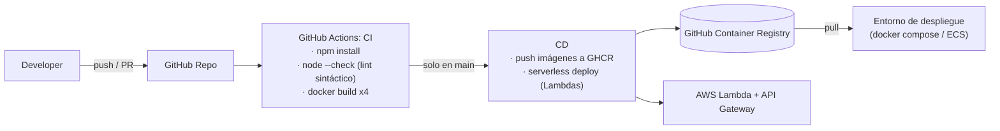

# Diagramas de la solución MediStock

> Todos los diagramas están en **Mermaid**: se renderizan directo en GitHub, o puedes pegarlos en https://mermaid.live para exportarlos como PNG/SVG e insertarlos en el informe.

---

## 1. Diagrama de Arquitectura (estilo/patrones seleccionados)

---

## 2. Diagrama de Secuencia — Flujo "Crear pedido"

---

## 3. Diagrama de Infraestructura (entorno local — Docker Compose)

---

## 4. Diagrama de Despliegue (proyección a producción en AWS)

---

## 5. Diagrama del pipeline CI/CD

